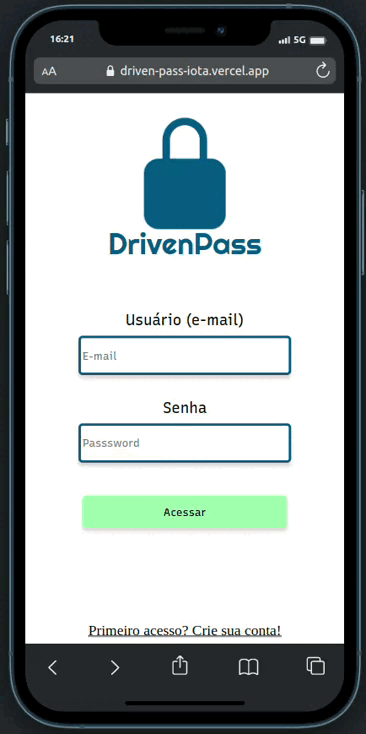

# Driven pass

<p align="center">
   
</p>

- Para uma senha ser segura, ela deve conter vários caracteres e números misturados, sem contar que o quanto mais longa ela for, melhor.
- Só que como vamos memorizar senhas gigantes e sem significado semântico? É para resolver essa dor de cabeça que surgiu o Driven pass! Com ele, criamos apenas uma senha “mestra” e todas as outras senhas ficam gravadas em segredo! Logo, quando precisamos dela, basta lembrar da senha “mestra”!
- Podemos armazenar Senhas de cartões, wifi, web sites e criar notas, tudo de forma segura e criptografada

- [Veja meu deploy na Vercel aqui](https://driven-pass-iota.vercel.app)
- [Veja meu repositório back end desta aplicação aqui](https://github.com/marcojr73/projeto19-drivenpass)

***

# Demonstração

<p align="center">
   
</p>

## Como usar

Instale meu projeto e configure o .env como no exemplo

```bash
  git clone git@github.com:marcojr73/drivenPass.git
  
  npm i
  
  npm start
```

***

##	 Tecnologias e Conceitos

- React
- Styled Componentes
- Persistência de login com local storage
- Context API

***
    